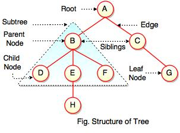

# Trees

---

## What are trees?

Trees are a _hierarchical data structure_. Each tree is made up of **nodes** and **edges**.
 + Each node contains a **value**.
 + Each node may or may not have edges to connect them to **child nodes**.
 + The node at the top of the tree is called the **root**.
 + Every node (except the root) has _exactly one_ parent node.
 + A node without any children is called a **leaf**.
 + The **height** of a tree is the longest distance from the root to a leaf.
 + The **depth** of a given node is the distance from it to the root.

---



Notice that any given node is the root of a tree itself, and this is called a **subtree**. (Side note: I think it should include node H?)

---

## Binary Trees

A **binary tree** is a tree where each node can have a maximum of two children. By convention, these are referred to as the _left child_ and the _right child_. These children are themselves the roots of the _left subtree_ and the _right subtree_.

---

## Binary Search Trees

A **binary search tree** is a binary tree with the additional rule that, given a node with a value `v`, the nodes in its _left subtree_ are all less than `v` and those in the _right subtree_ are greater than [or equal to] `v`.

Notice in the image that this is also true in the subtrees. While 6 is less than 8 and in the root's _left_ subtree, because it is greater than 3, it is in that node's _right_ subtree.


---

## What are the benefits of a binary search tree?

Both in terms of lookup and insertion, a BST takes an average of Θ(log n). The worst case is O(n) because you could have inserted values in a strictly increasing or decreasing value.

---

## Binary Search Tree Problems

```
       8
    /     \
   3       10
  / \      / \
 1   6    9   12
    / \      /
   4   7    11
```

Make a `BinarySearchTree` class. It should take a `value`, a `left_child`, and a `right_child`. These children should be either an instance of a binary search tree or empty.

Then work on the following methods:

- `add(value)`

- `contains(value)`

- `find_biggest()` / `find_smallest()`

- `depth_first_list()` * - list the values in order from smallest to largest. The above example would return 1, 3, 4, 6, 7, 8, 9, 10, 11, 12.

- `breadth_first_list()` * - list the elements level by level. Starting at the root, read the values left to right and then move down to the next level. So the above would return 8, 3, 10, 1, 6, 9, 12, 4, 7, 11.

- `delete_node()` ** Look up how to go about this.

---

## Tries

A **trie** is another tree-based data structure. It is supposed to be pronounced like "tree" as it's from _re**trie**val_, practically pronounced like "try" to differentiate from trees in general. In this structure, it is not nodes themselves that contain the values, but the edges and the path taken determine the key for a node.

---


We're going to talk about a particular implementation of a trie for word lookup. Here, any time you want to look up a word, you follow the path letter by letter. So if I am looking for 'tea', start at the top and follow the path for "t". From that node, follow the path for "e". One last time, follow the path for "a".

This might sound trivial, but down that path are _all_ words that start with 'tea' - 'team', 'tear', 'tearful', etc. This is why this data structure is very popular for predicting and/or autocompleting words.

---


Build a Trie class. This should hold:

 + `children` - a hash with the letters as keys and Trie instances as values may be the best implementation
 + `is_word` - a boolean that represents if the node is the termination of a word - in the example with "tea", the third node would have this as true as "tea" is a word, but first "t" and second "te" nodes would be false as those are not words.


Methods:

 + `search(str)` - returns true if a given string is in the trie and represents a word.
 
 + `get_node(str)` - returns the node after following the string. So in the example, `get_node('te')`this would return the node with children for "tea", "ted", and "ten".

 + `insert(word)` - if a string is not present in the trie, add it.
