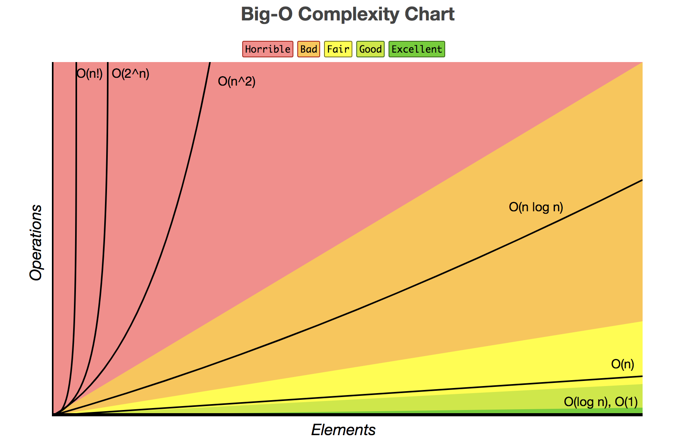

# Big O Cheatsheet

For a helper with various data structures and sorting algorithms, view the [Big O Cheatsheet site](http://bigocheatsheet.com/).

A longer video using the same slides can be found on at https://www.youtube.com/watch?v=tx0qG3DhA8Q&feature=youtu.be

## O(1): Constant
Things with O(1) do not change at all when the input changes.

**Examples:**

Space: Storing any value that is not dependent on input or does not grow as the input grows. Examples: counters, booleans, a single variable.

Time: Setting a single variable, accessing a value in an object with a key or in an array with the index, performing built-in mathematical operations

## O(n): Linear
Operations that are related directly to the input. So each time the input grows by a unit, the time increases by a set amount. It may be one more step or ten, but each step accounts for a set increase.

Time: mapping or iterating over an array, performing an action a number of times based on the input.

Space: mapping or copying arrays, creating a new value for each iteration

## O(n^2): Quadratic and
## O(n^c): Polynomial
Think loops on loops. The number of nested loops will give you the exponent. So a loop in a loop is n^2.

Time: Listing all possible combinations of 2 (or c) objects, often a brute force solution when trying to find pairs of things.

Space: All possible combinations of two (or c) objects.

---
## Less straightforward complexities
The following examples are good to know but usually involve more thought or things happing under the hood.

## O(log n): Logarithmic
This is common with lookup time in tree structures. One way to think about it is that every time you move down a level in a tree, the number of things you have left to go through roughly halves (or is cut to a third or a quarter, etc.) A binary search is a good example.

## O(n log(n)): Log Linear
In the wild, this is most common as the time that many common sorting algorithms take. If you are running a `.sort`, chances are the built-in function uses something like merge sort under the hood (or quick sort, which has O(n^2) but Θ(n log(n)) and Ω(n log(n))).

## O(2^n): Exponential (Or O(c^n))
Think brute-force Fibonacci. Every unit of growth doubles the number of steps you have to do. Also think of brute-force password guessing.

## O(n!): Factorial (Also O(n^n))
This is for every possible combination of n things. So as n grows, the base **and** the exponent grows. A common example is the Traveling Salesman Problem. This is **very** bad and usually something you want to avoid.
