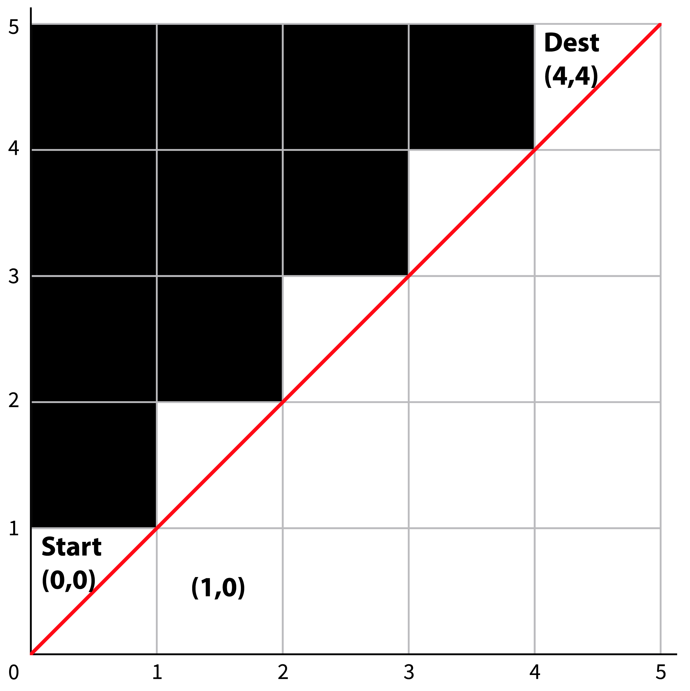

# Miscellaneous
## Questions

1. How many windows are there in New York?

  This is a classic question designed to see how you handle abstraction. Think about approaches and discuss how you would communicate your answer to this or a similar question - what is this question actually asking?

2. Write a function that performs a **binary search**.

  Given a sorted array and a value, this function will return true if the array contains the value and false otherwise.

  Think of this like looking up a word in the dictionary - start in the middle and determine if you have found what you are looking for and return true or if you need to look in the section before or after and repeat the process. Repeat until the value is found or until there are no more elements.

```
input: [1, 3, 4, 6, 7, 8, 10], 7

length => 7
midpoint => index: 3, value: 6

[1, 3, 4, 6, 7, 8, 10]
|         ^          |

7 > 6 => new section from index 4 - index 6

length => 3
midpoint => index: 5, value: 8

[1, 3, 4, 6, 7, 8, 10]
            |   ^    |

7 < 8 =>  new section from index 5 - index 5

length => 1
midpoint => index: 5, value: 7

[1, 3, 4, 6, 7, 8, 10]
            |^|

7 = 7 => return true
  ```

3. Sudoku Checker

  Write a function that takes in an array that represents a sudoku grid. Return true or false based on whether it is a valid solution.
  Rules of sudoku: https://en.wikipedia.org/wiki/Sudoku

4. Number of Paths

  Question from [Pramp](https://www.pramp.com/).

  You’re testing a new driverless car that is located at the Southwest (bottom-left) corner of an n×n grid. The car is supposed to get to the opposite, Northeast (top-right), corner of the grid. Given n, the size of the grid’s axes, write a function numOfPathsToDest that returns the number of the possible paths the driverless car can take.

  

  For convenience, let’s represent every square in the grid as a pair (i,j). The first coordinate in the pair denotes the east-to-west axis, and the second coordinate denotes the south-to-north axis. The initial state of the car is (0,0), and the destination is (n-1,n-1).

  The car must abide by the following two rules: it cannot cross the diagonal border. In other words, in every step the position (i,j) needs to maintain i >= j. See the illustration above for n = 5. In every step, it may go one square North (up), or one square East (right), but not both. E.g. if the car is at (3,1), it may go to (3,2) or (4,1).

  Explain the correctness of your function, and analyze its time and space complexities.
